# Backfill Engine 架构与执行流程

本文档已按 2026-07-20 的 Backfill 与 Daily 代码校正，用于：

- 按调用顺序通读代码；
- 在遗忘实现细节后快速恢复对脚本的理解；
- 回顾共享任务池、心跳、GC、账本和 Worker 熔断的设计关系；
- 解释每个模块在完整执行链路中的职责。

> Mermaid 是“图即代码”。GitHub、Obsidian、Typora 和 Notion 均可渲染本文中的主要图表。

## 一、先用一张思维导图认识系统

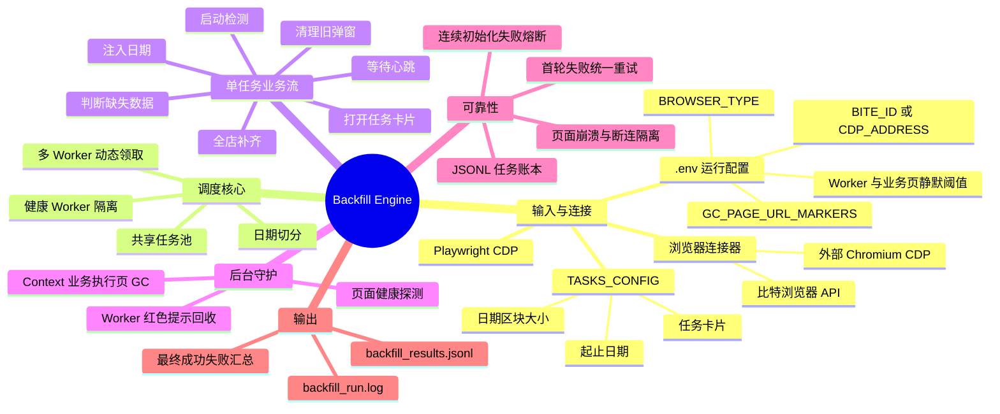

## 二、总体架构

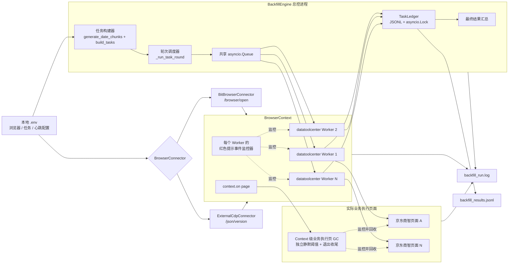

架构中存在三条互相解耦的执行线：

1. **主业务线**：任务池 → Worker → 数仓弹窗 → 商智采集；
2. **页面资源线**：Context 捕获商智页面 → 心跳监控 → 僵尸页面回收；
3. **可观测与恢复线**：日志 + JSONL 账本 → 失败任务重建 → 第二轮重试。

## 三、推荐的代码阅读顺序

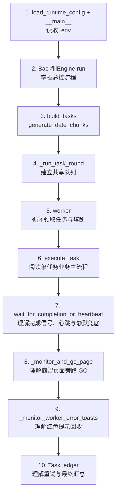

| 阅读层级 | 核心函数 | 需要回答的问题 |
|---|---|---|
| 总控 | `run()` | 浏览器、Context、Worker、守护协程和两轮执行如何组装？ |
| 调度 | `_run_task_round()` | 如何建立共享队列，如何筛选健康 Worker？ |
| Worker | `worker()` | 一个页面如何持续领取任务，何时熔断？ |
| 业务 | `execute_task()` | 一个日期区块如何完成检测与补齐？ |
| 状态判断 | `wait_for_completion_or_heartbeat()` | 如何用完成弹窗提前确认成功，并保留静默复检兜底？ |
| 页面 GC | `_monitor_and_gc_page()` | 商智页面为什么独立于 Worker，何时关闭？ |
| UI 守护 | `_monitor_worker_error_toasts()` | 红色提示如何事件驱动回收并避免重复处理？ |
| 持久化 | `TaskLedger` | 首轮失败项如何变成第二轮任务？ |

## 四、程序启动与总控时序

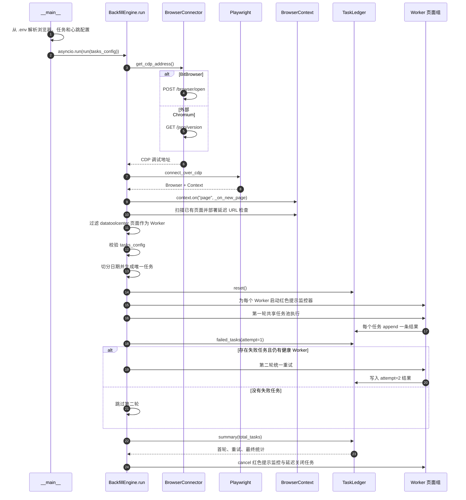

## 五、配置如何变成共享任务池

假设 `.env` 中的 `TASKS_CONFIG` 包含：

```dotenv
TASKS_CONFIG=[{"card":3,"start":"2025-07-01","end":"2025-07-07","chunk_days":3}]
```

会生成：

```text
card-3_2025-07-01_2025-07-03
card-3_2025-07-04_2025-07-06
card-3_2025-07-07_2025-07-07
```

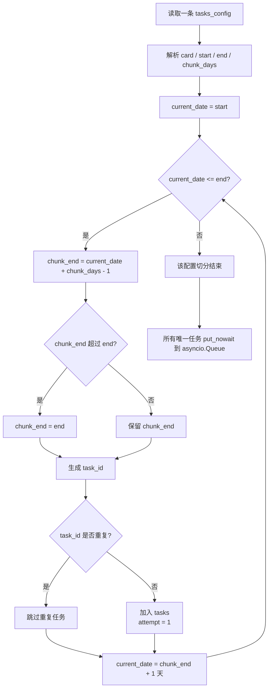

日期切分使用 `datetime.strptime()`，因此不存在 `2025-09-31` 这种日期被静默接受的情况：非法日期会在任务池生成阶段直接抛出 `ValueError`，不会先生成第 31 个网页任务。

## 六、一轮共享任务池如何运行

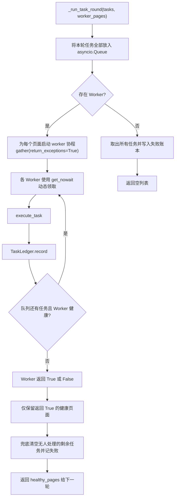

共享池没有为任务预先绑定 Worker，所以执行顺序遵循：

- 队列中的任务保持配置展开后的先后顺序；
- 哪个 Worker 先空闲，哪个 Worker 就领取下一个任务；
- 不保证同一卡片始终由同一页面处理；
- 快 Worker 会自然承担更多任务，避免等待慢 Worker。

## 七、Worker 生命周期与熔断状态机

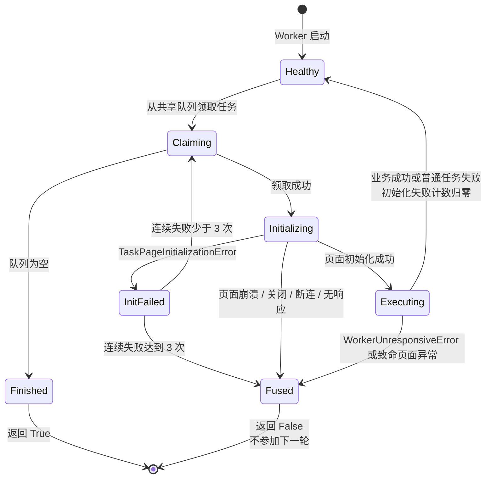

这里有一个关键区分：

- **业务任务失败**：任务写入 `success=false`，Worker 可以继续工作；
- **执行者失败**：Worker 熔断，停止领取后续任务；
- **普通初始化失败**：允许最多连续出现 3 次，给页面短暂恢复机会；
- **页面无响应或断连**：立即熔断，不消耗更多共享任务。

## 八、单个日期任务的完整业务流程

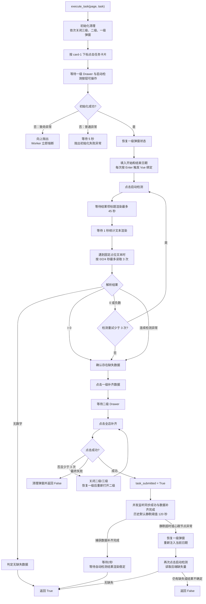

### 缺失量判断的业务兜底

| 页面文本结果 | 脚本判断 | 后续动作 |
|---|---|---|
| 找不到任何数字 | 无缺失 | 当前任务成功结束 |
| 数字大于 0 | 有缺失 | 进入补齐流程 |
| 数字等于 0 或为负数 | 前端渲染假象 | 重新启动检测，最多 3 次 |
| 固定文本 `：表示缺失数据` | 统计文本仍在渲染 | 按 0/2/4 秒等待后重读，连续 3 次仍未完成则当前任务失败 |
| 普通检测异常 | 本次后端检测不可信 | 重新点击启动检测，最多 3 次；首次检测最终不确定时进入补齐兜底，终态复检最终不确定时记为失败 |

## 九、三级弹窗层级与精准关闭

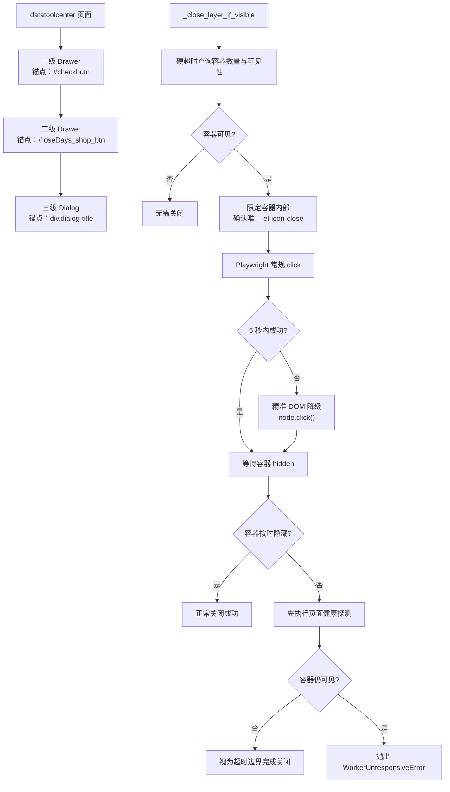

精准 DOM 点击并不是业务按钮的通用强制点击。它只用于：

- 已经被具体弹窗容器限定；
- 容器内部只有一个关闭叉号；
- 常规 Playwright 点击已经超时；
- 操作后能够验证容器确实隐藏。

容器在等待期限内正常进入 `hidden`，已经证明关闭动作和 DOM 状态观察均成功，因此直接视为关闭完成。只有等待 `hidden` 超时时，才额外执行 `document.readyState` 健康探测并二次查询容器：页面仍响应且容器恰好已经隐藏时，才视为“在超时边界完成关闭”。

`#checkbutn`、`#loseDays_shop_btn` 等业务按钮仍保留 Playwright 的遮挡和可操作性检查。

## 十、Worker 心跳与终态判断

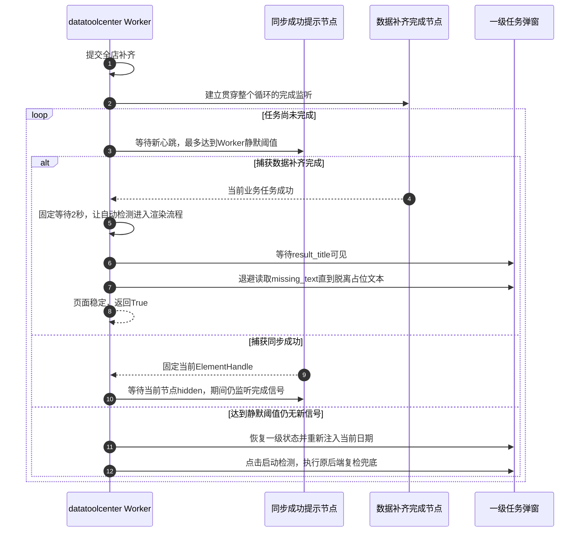

“数据补齐完成”是已提交任务的权威成功信号，即使系统中存在无法采集的固定缺失数据，任务仍可正常完成。捕获该信号后不再解析缺失数量，而是等待网页自动检测稳定：固定缓冲2秒，等待 `div.testContent_list_title_dayType` 可见，再按0、2、4秒退避读取顶部统计，直到文本不再是 `：表示缺失数据`。随后返回成功，下一任务通过正常初始化流程关闭一级弹窗并回到任务大盘。

如果没有捕获完成信号，达到 Worker 静默阈值本身仍不等于成功。此时保留原有兜底：恢复页面层级、重新注入日期并请求后端缺失量。历史模式默认阈值为120秒：

- 统计文本不含数字，按现有页面协议表示无缺失：任务成功；
- 缺失数量大于 0：任务失败并进入对应模式的重试流程；
- 连续 3 次得到 0、负数或读取异常：结果不确定，保守记为失败。

每次检测会先等待结果列表内部的 `div.testContent_list_title_dayType` 标题渲染，再等待 1 秒读取顶部缺失统计。若读到固定占位文本 `：表示缺失数据`，不会重新请求后端，而是按 0、2、4 秒的退避节奏读取同一轮结果；连续 3 次仍为占位文本时，本次任务直接失败。

## 十一、Context 级业务执行页面 GC

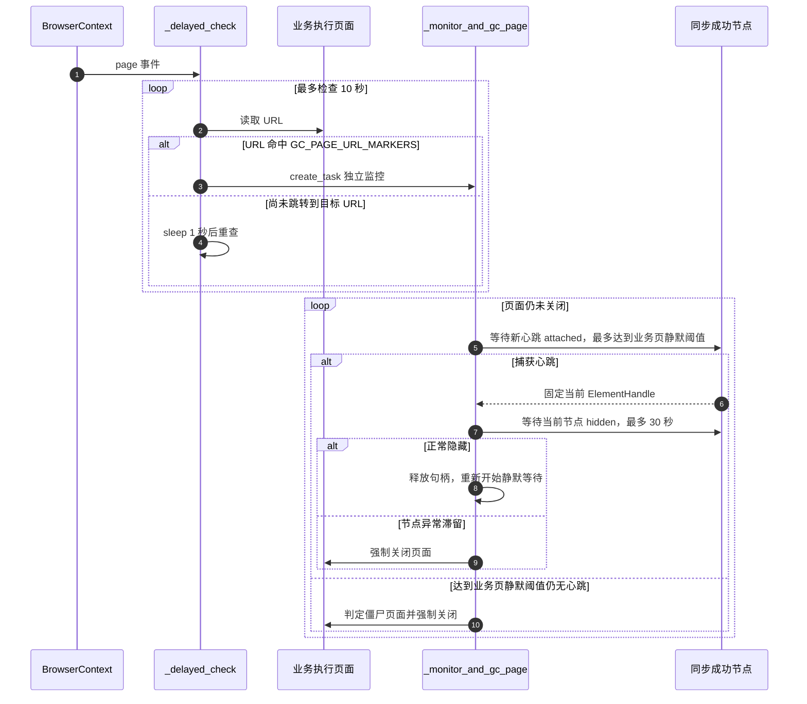

GC 不维护业务执行页面与某个 Worker 的固定映射。原因是一个任务队列中的商智页面可能自动关闭并重新创建；Context 级捕获可以覆盖运行期间出现的全部业务页面生命周期，启动时已经存在的页面也会被扫描。

Worker 与业务页使用两套可独立配置的静默阈值，业务页阈值必须更长。默认 120/180 秒时错开 60 秒：

- Worker 先判断数仓任务完成或卡死，并清理数仓弹窗；
- 商智 GC 后处理仍未自行消失的执行页面；
- 两套机制不需要互相持有引用。

### URL 识别规则与多平台扩展

当前纳入 GC 的页面由 `.env` 中的统一 URL 标记决定：

```dotenv
GC_PAGE_URL_MARKERS=["ppzh.jd.com"]
```

程序启动后，该 JSON 数组会转换为 `BackfillEngine.gc_page_url_markers` 元组。`_delayed_check()` 的实时页面捕获和程序结束时的残留页扫描都调用 `_is_gc_managed_page_url()`，因此不会出现两个地方分别维护多组 `or` 条件。未来增加抖音时，可以把对应域名标记追加到 `.env` 数组中。

但只增加 URL 的前提是该平台使用相同的心跳协议，即同样通过 `.el-message__content:has-text('同步成功')` 产生并隐藏成功节点。如果抖音的提示文字、DOM 或任务生命周期不同，就应进一步把配置扩展为“URL 标记 + 心跳选择器 + 静默时间”的平台策略，而不能只增加 URL。

### 程序退出前的 GC 收尾

主调度完成时，如果 Context 中已经没有业务执行页面，程序立即退出；如果仍有残留页面，则执行以下收尾：

1. 等待 `180 - 120 + 5 = 65` 秒，让已有 GC 协程完成剩余静默窗口；
2. 宽限期内页面全部自然关闭，则正常退出；
3. 宽限期后重新扫描 Context；
4. 对仍然残留的业务执行页面执行兜底关闭；
5. 完成收尾后再退出 Playwright，避免事件循环提前结束导致 GC 被取消。

## 十二、红色错误提示事件回收器

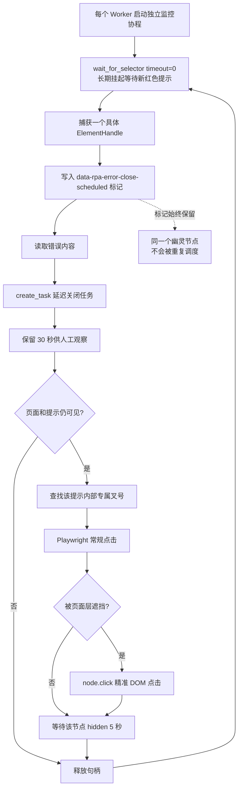

该机制是事件驱动的：没有红色提示时，协程阻塞在浏览器事件等待上，不会每秒轮询 DOM。

它与商智 GC 的共同思想是“捕获具体对象后管理它的生命周期”，但回收粒度不同：

- 红色提示回收器处理 Worker 页面内的 UI 节点；
- 商智 GC 处理整个商智标签页。

## 十三、短页面操作的硬超时与健康探测

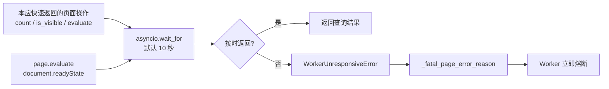

`document.readyState` 可能返回：

- `loading`：文档仍在加载；
- `interactive`：DOM 已构建；
- `complete`：页面及资源完成加载。

这里的主要目的不是要求页面必须达到 `complete`，而是验证浏览器渲染进程能否在 10 秒内执行一次 JavaScript 并返回合法状态。只要 JS 往返及时完成，就证明页面事件循环仍有响应。

硬超时只包裹理论上应快速完成的页面探针，不包裹完整补采任务，因此不会因为任务实际运行数小时而误杀 Worker。

## 十四、JSONL 账本与统一重试

每一次最终任务尝试写入一行：

```json
{"task_id":"card-3_2025-07-01_2025-07-01","card":3,"start":"2025-07-01","end":"2025-07-01","attempt":1,"success":false}
```

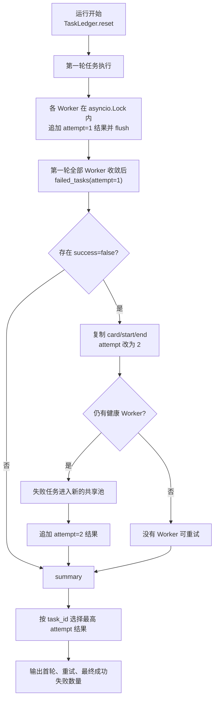

当前 Backfill 策略是：

- 首轮所有任务执行完毕后才读取失败项；
- 失败任务统一进入第二轮；
- 第二轮只使用第一轮结束后仍健康的 Worker；
- 只进行一次总体重试；
- 两轮之间没有额外固定等待，也不是指数退避。

## 十五、异常分类与处理矩阵

| 异常类型 | 典型场景 | 当前任务 | 当前 Worker | 第二轮 |
|---|---|---|---|---|
| 普通业务失败 | 二级弹窗打不开、全店补齐未提交、任务判定卡死 | 写入失败 | 继续领取 | 任务进入重试 |
| 单次初始化失败 | 旧弹窗或页面状态暂时异常 | 写入失败 | 累计一次 | 任务进入重试 |
| 连续 3 次初始化失败 | 页面长期无法恢复到可操作状态 | 第 3 个任务写入失败 | 熔断 | 不参加第二轮 |
| 页面查询硬超时 | `count()`、`is_visible()`、JS 健康探测无响应 | 写入失败或结果未知 | 立即熔断 | 不参加第二轮 |
| 页面崩溃或断连 | Page、Target、Context、Browser 关闭 | 结果按提交状态记录说明 | 立即熔断 | 不参加第二轮 |
| 业务页达到 GC 静默阈值 | 业务执行页成为僵尸页面 | 不直接决定账本结果 | 不绑定 Worker | GC 关闭业务页 |
| 红色提示遮挡 | 登录失效或接口异常导致提示堆积 | 主业务继续运行 | 监控器延迟回收 | 不直接影响轮次 |

## 十六、脚本模块职责说明

### 1. 配置与入口模块

`load_runtime_config()` 从源码或 exe 同目录的 `.env` 读取浏览器类型、连接参数、任务列表、GC URL 标记和历史模式心跳阈值。列表使用 JSON 表达并经过类型校验；入口随后创建对应连接器和 `BackfillEngine`，再通过 `asyncio.run()` 启动异步总控流程。真实 `.env` 只保留在本地，仓库仅提交 `.env.example`。

### 2. 浏览器连接模块

`BitBrowserConnector` 使用 `BITE_ID` 调用比特浏览器本地 API；`ExternalCdpConnector` 使用 `CDP_ADDRESS` 请求 `/json/version`，确认端口确实提供 Chromium CDP。二者统一返回 `host:port`，`run()` 无需知道浏览器来源，只负责使用 Playwright 接管浏览器，并把 URL 包含 `datatoolcenter` 的标签页识别为 Worker。

### 3. 任务构建模块

`generate_date_chunks()` 按 `chunk_days` 切分历史区间；`build_tasks()` 为每个日期区块生成唯一 `task_id`，去除重复配置，然后形成首轮任务列表。

### 4. 轮次调度模块

`_run_task_round()` 把一轮任务放入共享 `asyncio.Queue`，为每个可用页面启动一个 `worker()` 协程。任务不预先绑定页面，由先空闲的 Worker 继续领取下一项，实现动态负载均衡。

### 5. Worker 执行与熔断模块

`worker()` 负责循环领取任务、调用 `execute_task()`、把结果写入账本，并维护连续初始化失败次数。普通业务失败不会淘汰 Worker；连续 3 次初始化失败、页面无响应、崩溃或断连会触发熔断。

### 6. 单任务业务模块

`execute_task()` 完成一个日期区块的全部业务操作：清理遗留弹窗、进入指定任务卡片、注入日期、启动检测、读取缺失量、打开二级弹窗、点击全店补齐，并进入心跳终态判断。

### 7. 弹窗定位与恢复模块

`_primary_drawer()`、`_secondary_drawer()` 和 `_progress_dialog()` 使用内部业务锚点区分三级容器。`_close_layer_if_visible()` 只对弹窗内部唯一叉号提供精准 DOM 降级；`_restore_primary_state()` 负责回到一级弹窗可操作状态。

### 8. Worker 心跳模块

`wait_for_completion_or_heartbeat()` 在数仓 Worker 页并发监听“同步成功”和“数据补齐完成”。完成信号优先确认任务成功，脚本等待自动检测结果脱离渲染占位状态后立即释放Worker；没有完成信号时，达到静默阈值仍使用后端复检兜底。历史模式默认120秒，也可通过 `.env` 调整。

### 9. 业务执行页面 GC 模块

`_on_new_page()` 与 `_delayed_check()` 从 BrowserContext 层识别符合 URL 标记的业务执行页面，`_monitor_and_gc_page()` 独立监听每个页面的成功心跳。达到业务页静默阈值或单个心跳节点异常滞留时，GC 关闭该页面；主调度结束后，`_cleanup_remaining_gc_pages()` 按两个静默阈值之差再加 5 秒提供收尾宽限。历史模式默认 Worker/业务页为 120/180 秒。

### 10. 红色错误提示回收模块

`_monitor_worker_error_toasts()` 事件等待每个 Worker 页面的红色提示，为具体节点添加防重复标记，并创建延迟关闭任务。提示保留 30 秒后关闭；常规点击被遮挡时，仅对专属叉号使用 `node.click()`。

### 11. 页面健康与硬超时模块

`_await_page_operation()` 为本应快速完成的 DOM 查询增加 10 秒外层硬超时。`_assert_page_healthy()` 通过 `document.readyState` 执行一次 JavaScript 往返，用于确认超时页面的渲染事件循环是否还能响应。

### 12. 任务账本与重试模块

`TaskLedger` 使用 `asyncio.Lock` 串行追加 JSONL 结果。首轮结束后，`failed_tasks(attempt=1)` 从账本重建失败任务并把 `attempt` 改为 2；健康 Worker 统一执行第二轮，最后由 `summary()` 按每个任务的最新结果汇总。

## 十七、脚本完整运行逻辑摘要

1. 从 `.env` 读取并校验浏览器来源、连接参数、任务、GC URL 和心跳阈值；
2. 使用 `BITE_ID` 启动比特浏览器，或使用 `CDP_ADDRESS` 检查外部 Chromium；
3. 连接 BrowserContext，识别数仓 Worker 页面；
4. 在 Context 层挂载业务执行页面 GC，并扫描已有页面；
5. 把配置日期切分成唯一日期区块，生成首轮任务列表；
6. 重置 JSONL 任务账本，为每个 Worker 启动红色提示监控器；
7. 把首轮任务全部放入共享任务池，由多个 Worker 动态领取；
8. 每个 Worker 清理遗留弹窗，打开任务卡片并注入当前区间日期；
9. 检测缺失数据；无缺失则直接成功，有缺失则进入全店补齐；
10. 提交后并发监听心跳和数据补齐完成；完成信号出现后等待自动检测稳定并立即成功，未捕获时才在静默后执行原后端复检兜底；
11. 业务执行页 GC 使用更长的独立静默阈值回收没有正常关闭的页面；
12. 每个任务结束后立即把本次尝试结果追加到 JSONL；
13. Worker 发生普通任务失败时继续领取，发生致命页面异常时退出任务池；
14. 首轮全部 Worker 收敛后，从 JSONL 读取失败任务；
15. 仅由仍然健康的 Worker 对失败任务统一重试一次；
16. 根据每个 `task_id` 的最新尝试结果输出最终成功和失败汇总；
17. 停止红色提示监控器，并取消尚未完成的30秒延迟关闭协程；
18. 如果仍有业务执行页面，按两个静默阈值之差加 5 秒交给 GC 自然收尾，再兜底关闭残留页面；
19. 退出 Playwright 连接，程序结束。

## 十八、Daily Mode：登录态重建、动态 Worker 与旁路通知

`daily_engine.py` 复用历史补采的 Worker、弹窗、GC、账本和失败重试能力，但外围生命周期不同：它先关闭并重启指定 Bit 浏览器，再为本次单日任务创建 Worker 页面。

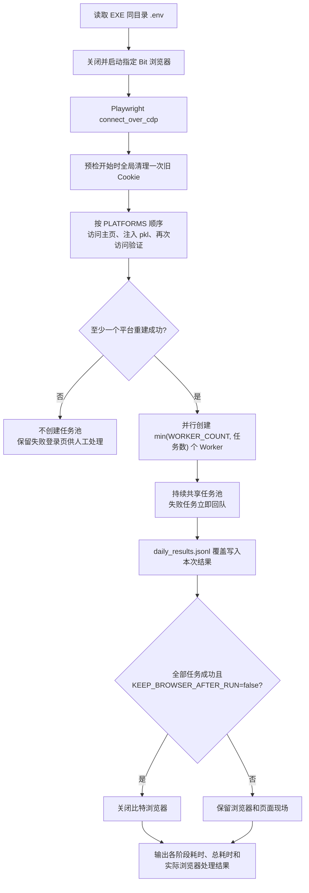

Daily 的计时使用 `time.perf_counter()`，分别覆盖浏览器关闭并重启、登录预检、Worker 初始化和持续任务池；外层 `finally` 统一补充总运行时间。因此参数错误、浏览器启动失败或登录预检失败等提前退出路径，也会留下总耗时和实际浏览器处理结果，而不会再固定打印“保留现场”。

### 登录态重建预检

日常模式不能假定 Bit 浏览器中已有 Cookie 可靠可用。预检因此不是“当前 URL 没有出现 login 就通过”，而是一次确定性的登录态重建：

1. 对整个 `BrowserContext` 执行一次 `clear_cookies()`；
2. 对 `.env` 的每个 `PLATFORMS` 项访问 `home_url`，加载该平台 pkl 中 `cookie_key` 对应的 Cookie 并注入；
3. 再次访问 `home_url`；仍进入 `login_url_markers` 指定的登录页则判定失败；
4. 成功预检页关闭，失败预检页保留给人工巡检或登录。

`BrowserContext` 的 Cookie 覆盖全部站点，所以清理动作必须只执行一次。若在“注入抖音 Cookie”后又为京东执行全局清理，抖音 Cookie 会被删除，最终抖音业务页仍会失效。

### 单机飞书巡检器

`daily_notify_agent.py` 不接入浏览器，也不读取内存中的任务池。它以文件为边界，递归扫描本机 `dailyfill` 下每个客户目录的 `.env`：

1. `REPORT_READY_TIME` 未到的客户不纳入本次通知；
2. 用 `DAILY_TASKS`、`TARGET_DATE` 或日期偏移量还原当天应有的 `task_id`；
3. 读取 `daily_results.jsonl` 的每个任务最新尝试，计算完成数量；
4. 任务未完成时检查 `daily_run.log` 的最后修改时间，超过阈值则标记“疑似故障”；
5. 将全部客户状态合并为一条飞书文本消息。

这使采集 EXE 与通知 EXE 可以独立运行：采集异常不会阻止通知器读取上一次账本和日志；通知器异常也不会影响采集任务。

### Daily 专属即时重试

历史补采保留“首轮全部完成后，从账本重建失败项并统一重试”的轮次模型。Daily 的任务只有少量卡片，若继续等待整轮结束，会让提前完成或失败的 Worker 长时间空闲，因此使用独立的持续任务池：

1. Worker 使用 `await queue.get()` 持续等待任务，不因队列暂时为空立即退出；
2. 每次尝试都先把结果追加到 `daily_results.jsonl`；
3. 失败且未达到 `MAX_ATTEMPTS` 时，将任务的 `attempt` 加一并立即放回队尾；
4. 成功或达到最大次数后不再回队；
5. `queue.join()` 只会在所有任务到达终态后返回，调度器随后用哨兵统一停止健康 Worker；
6. 页面无响应、崩溃或断连仍会使当前 Worker 熔断，但其失败任务可以由其他健康 Worker 继续领取。

该分叉只存在于 `DailyEngine`。`BackfillEngine` 的历史区块调度和唯一一次总体重试保持不变。

### 统一的业务 UI 超时

Backfill 与 Daily 共用的任务卡片弹窗、检测按钮、缺失数量节点、补齐按钮等普通业务元素，其等待和点击统一放宽到 30 秒，用于承受多脚本并存时的短暂资源竞争。代码不再维护模式专属的 timeout 覆盖字段。

以下时间没有被统一放宽，因为它们承担不同语义：

- 一级弹窗恢复后的 5 秒 `trial=True` 可操作性检查；
- `page.goto()` 与 datatoolcenter 自动登录后的稳定等待；
- 10 秒页面健康探针；
- Worker 心跳静默判断（历史模式可配置，默认 120 秒）；
- 业务执行页 GC 静默判断（历史模式可配置，默认 180 秒）；
- 单个 Worker/GC 心跳节点 30 秒隐藏等待；
- 红色提示和弹窗关闭器的旁路回收超时。
