# Backfill Engine 架构与执行流程

本文档按当前 Backfill 与 Daily 主线代码维护，用于：

- 按调用顺序通读代码；
- 在遗忘实现细节后快速恢复对脚本的理解；
- 回顾共享任务池、心跳、GC、账本和 Worker 熔断的设计关系；
- 解释每个模块在完整执行链路中的职责。

> Mermaid 是“图即代码”。GitHub、Obsidian、Typora 和 Notion 均可渲染本文中的主要图表。

## 一、先用一张思维导图认识系统

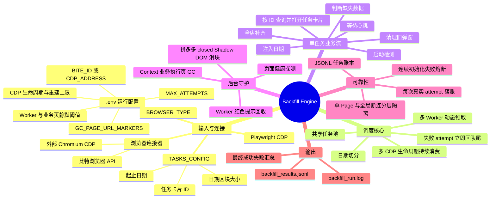
```mermaid
mindmap
  root((Backfill Engine))
    输入与连接
      .env 运行配置
        BROWSER_TYPE
        BITE_ID 或 CDP_ADDRESS
        GC_PAGE_URL_MARKERS
        Worker 与业务页静默阈值
        MAX_ATTEMPTS
        CDP 生命周期与重建上限
      TASKS_CONFIG
        任务卡片 ID
        起止日期
        日期区块大小
      浏览器连接器
        比特浏览器 API
        外部 Chromium CDP
      Playwright CDP
    调度核心
      日期切分
      共享任务池
      多 Worker 动态领取
      失败 attempt 立即回队尾
      多 CDP 生命周期持续消费
    单任务业务流
      清理旧弹窗
      按 ID 查询并打开任务卡片
      注入日期
      启动检测
      判断缺失数据
      全店补齐
      等待心跳
    后台守护
      Worker 红色提示回收
      Context 业务执行页 GC
      拼多多 closed Shadow DOM 滑块
      页面健康探测
    可靠性
      JSONL 任务账本
      每次真实 attempt 落账
      连续初始化失败熔断
      单 Page 与全局断连分层隔离
    输出
      backfill_run.log
      backfill_results.jsonl
      最终成功失败汇总
```

## 二、总体架构

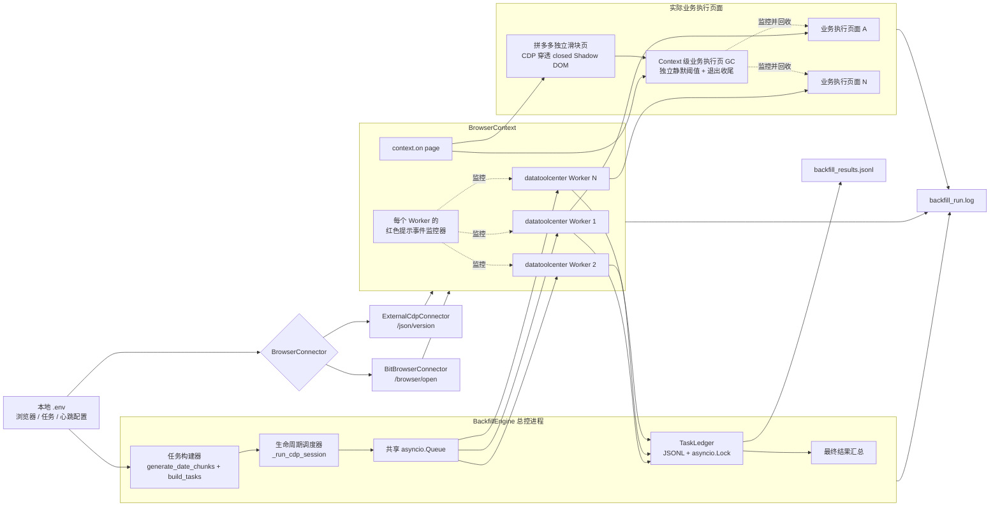
```mermaid
flowchart LR
    Config["本地 .env<br/>浏览器 / 任务 / 心跳配置"]
    Connector{"BrowserConnector"}
    BitAPI["BitBrowserConnector<br/>/browser/open"]
    External["ExternalCdpConnector<br/>/json/version"]

    subgraph Engine["BackfillEngine 总控进程"]
        Builder["任务构建器<br/>generate_date_chunks + build_tasks"]
        Pool["共享 asyncio.Queue"]
        Scheduler["生命周期调度器<br/>_run_cdp_session"]
        Ledger["TaskLedger<br/>JSONL + asyncio.Lock"]
        Summary["最终结果汇总"]
    end

    subgraph Context["BrowserContext"]
        W1["datatoolcenter Worker 1"]
        W2["datatoolcenter Worker 2"]
        WN["datatoolcenter Worker N"]
        ToastGuard["每个 Worker 的<br/>红色提示事件监控器"]
        PageEvent["context.on page"]
    end

    subgraph Business["实际业务执行页面"]
        JD1["业务执行页面 A"]
        JDN["业务执行页面 N"]
        Slider["拼多多独立滑块页<br/>CDP 穿透 closed Shadow DOM"]
        GC["Context 级业务执行页 GC<br/>独立静默阈值 + 退出收尾"]
    end

    Log["backfill_run.log"]
    Result["backfill_results.jsonl"]

    Config --> Connector
    Connector --> BitAPI
    Connector --> External
    BitAPI --> Context
    External --> Context
    Config --> Builder --> Scheduler
    Scheduler --> Pool
    Pool --> W1
    Pool --> W2
    Pool --> WN
    W1 --> Ledger
    W2 --> Ledger
    WN --> Ledger
    Ledger --> Result
    Ledger --> Summary
    ToastGuard -.监控.-> W1
    ToastGuard -.监控.-> W2
    ToastGuard -.监控.-> WN
    W1 --> JD1
    WN --> JDN
    PageEvent --> GC
    PageEvent --> Slider --> GC
    GC -.监控并回收.-> JD1
    GC -.监控并回收.-> JDN
    Engine --> Log
    Context --> Log
    Business --> Log
```

架构中存在三条互相解耦的执行线：

1. **主业务线**：任务池 → Worker → 数仓弹窗 → 业务平台采集；
2. **页面资源线**：Context 按 URL 标记捕获业务执行页 → 心跳监控 → 僵尸页面回收；
3. **可观测与恢复线**：日志 + JSONL 账本 → 失败 attempt 立即回队 → 必要时重建 CDP 会话。

## 三、推荐的代码阅读顺序

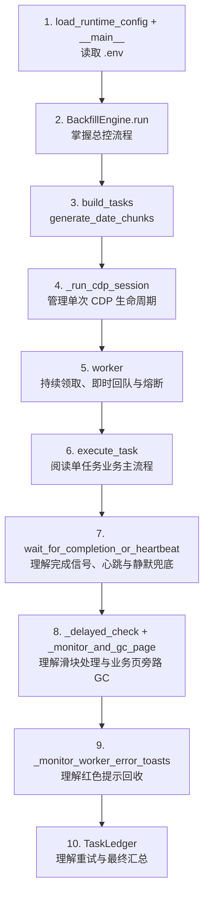
```mermaid
flowchart TD
    A["1. load_runtime_config + __main__<br/>读取 .env"] --> B["2. BackfillEngine.run<br/>掌握总控流程"]
    B --> C["3. build_tasks<br/>generate_date_chunks"]
    C --> D["4. _run_cdp_session<br/>管理单次 CDP 生命周期"]
    D --> E["5. worker<br/>持续领取、即时回队与熔断"]
    E --> F["6. execute_task<br/>阅读单任务业务主流程"]
    F --> G["7. wait_for_completion_or_heartbeat<br/>理解完成信号、心跳与静默兜底"]
    G --> H["8. _delayed_check + _monitor_and_gc_page<br/>理解滑块处理与业务页旁路 GC"]
    H --> I["9. _monitor_worker_error_toasts<br/>理解红色提示回收"]
    I --> J["10. TaskLedger<br/>理解重试与最终汇总"]
```

| 阅读层级 | 核心函数 | 需要回答的问题 |
|---|---|---|
| 总控 | `run()` | 持久队列、浏览器身份和多次 CDP 会话如何组装？ |
| 调度 | `_run_cdp_session()` | 如何停止领取、等待在途任务并收束旧会话？ |
| Worker | `worker()` | 一个页面如何持续领取任务，何时熔断？ |
| 业务 | `execute_task()` | 一个日期区块如何完成检测与补齐？ |
| 状态判断 | `wait_for_completion_or_heartbeat()` | 完成弹窗如何触发自动检测结果读取，静默时如何主动复检？ |
| 新页面与 GC | `_delayed_check()`、`_solve_slider_page()`、`_monitor_and_gc_page()` | 普通业务页与拼多多滑块页如何识别、处理和回收？ |
| UI 守护 | `_monitor_worker_error_toasts()` | 红色提示如何事件驱动回收并避免重复处理？ |
| 持久化 | `TaskLedger` | 每个真实 attempt 如何落账并形成最终汇总？ |

## 四、程序启动与总控时序

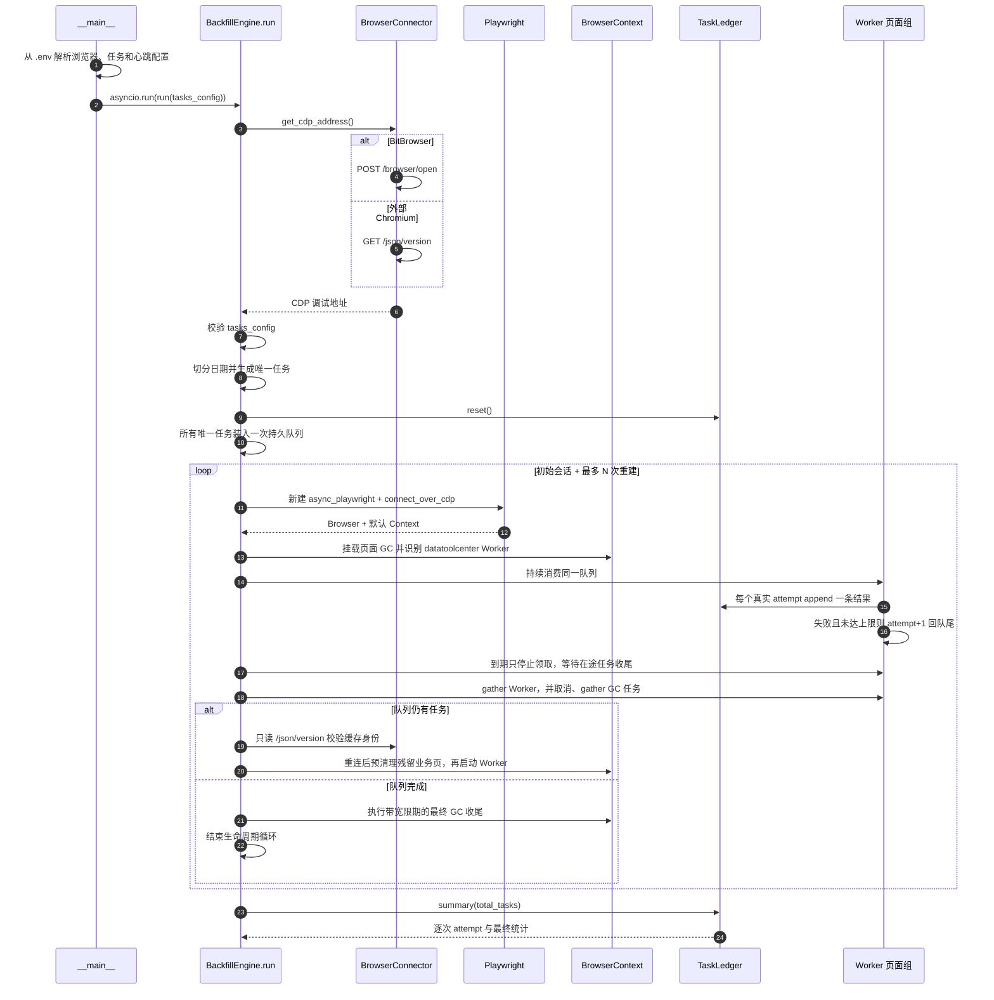
```mermaid
sequenceDiagram
    autonumber
    participant Main as __main__
    participant Engine as BackfillEngine.run
    participant Connector as BrowserConnector
    participant PW as Playwright
    participant Ctx as BrowserContext
    participant Ledger as TaskLedger
    participant Workers as Worker 页面组

    Main->>Main: 从 .env 解析浏览器、任务和心跳配置
    Main->>Engine: asyncio.run(run(tasks_config))
    Engine->>Connector: get_cdp_address()
    alt BitBrowser
        Connector->>Connector: POST /browser/open
    else 外部 Chromium
        Connector->>Connector: GET /json/version
    end
    Connector-->>Engine: CDP 调试地址
    Engine->>Engine: 校验 tasks_config
    Engine->>Engine: 切分日期并生成唯一任务
    Engine->>Ledger: reset()
    Engine->>Engine: 所有唯一任务装入一次持久队列
    loop 初始会话 + 最多 N 次重建
        Engine->>PW: 新建 async_playwright + connect_over_cdp
        PW-->>Engine: Browser + 默认 Context
        Engine->>Ctx: 挂载页面 GC 并识别 datatoolcenter Worker
        Engine->>Workers: 持续消费同一队列
        Workers->>Ledger: 每个真实 attempt append 一条结果
        Workers->>Workers: 失败且未达上限则 attempt+1 回队尾
        Engine->>Workers: 到期只停止领取，等待在途任务收尾
        Engine->>Workers: gather Worker，并取消、gather GC 任务
        alt 队列仍有任务
            Engine->>Connector: 只读 /json/version 校验缓存身份
            Engine->>Ctx: 重连后预清理残留业务页，再启动 Worker
        else 队列完成
            Engine->>Ctx: 执行带宽限期的最终 GC 收尾
            Engine->>Engine: 结束生命周期循环
        end
    end
    Engine->>Ledger: summary(total_tasks)
    Ledger-->>Engine: 逐次 attempt 与最终统计
```

## 五、配置如何变成共享任务池

假设 `.env` 中的 `TASKS_CONFIG` 包含：

```dotenv
TASKS_CONFIG=[{"card":1001,"start":"2025-07-01","end":"2025-07-07","chunk_days":3}]
```

会生成：

```text
card-1001_2025-07-01_2025-07-03
card-1001_2025-07-04_2025-07-06
card-1001_2025-07-07_2025-07-07
```

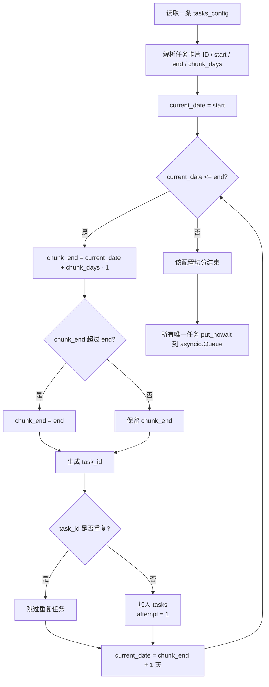
```mermaid
flowchart TD
    A["读取一条 tasks_config"] --> B["解析任务卡片 ID / start / end / chunk_days"]
    B --> C["current_date = start"]
    C --> D{"current_date <= end?"}
    D -->|"否"| J["该配置切分结束"]
    D -->|"是"| E["chunk_end = current_date + chunk_days - 1"]
    E --> F{"chunk_end 超过 end?"}
    F -->|"是"| G["chunk_end = end"]
    F -->|"否"| H["保留 chunk_end"]
    G --> I["生成 task_id"]
    H --> I
    I --> K{"task_id 是否重复?"}
    K -->|"是"| L["跳过重复任务"]
    K -->|"否"| M["加入 tasks<br/>attempt = 1"]
    L --> N["current_date = chunk_end + 1 天"]
    M --> N
    N --> D
    J --> O["所有唯一任务 put_nowait 到 asyncio.Queue"]
```

日期切分使用 `datetime.strptime()`，因此不存在 `2025-09-31` 这种日期被静默接受的情况：非法日期会在任务池生成阶段直接抛出 `ValueError`，不会先生成第 31 个网页任务。

## 六、跨 CDP 生命周期的共享任务池

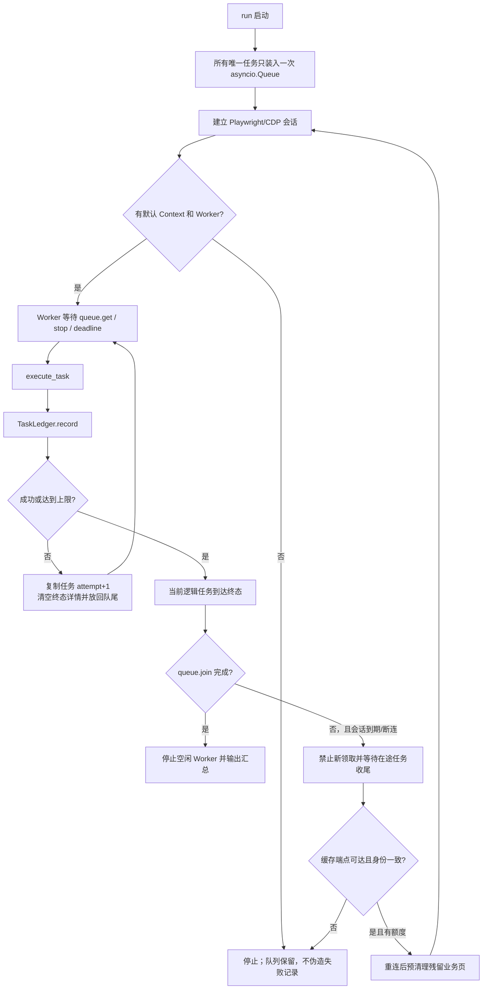
```mermaid
flowchart TD
    Start["run 启动"] --> Fill["所有唯一任务只装入一次 asyncio.Queue"]
    Fill --> Session["建立 Playwright/CDP 会话"]
    Session --> HasWorker{"有默认 Context 和 Worker?"}
    HasWorker -->|"否"| Stop["停止；队列保留，不伪造失败记录"]
    HasWorker -->|"是"| Claim["Worker 等待 queue.get / stop / deadline"]
    Claim --> Execute["execute_task"]
    Execute --> Record["TaskLedger.record"]
    Record --> Success{"成功或达到上限?"}
    Success -->|"否"| Retry["复制任务 attempt+1<br/>清空终态详情并放回队尾"]
    Retry --> Claim
    Success -->|"是"| Done["当前逻辑任务到达终态"]
    Done --> QueueDone{"queue.join 完成?"}
    QueueDone -->|"是"| Finish["停止空闲 Worker 并输出汇总"]
    QueueDone -->|"否，且会话到期/断连"| Settle["禁止新领取并等待在途任务收尾"]
    Settle --> Identity{"缓存端点可达且身份一致?"}
    Identity -->|"是且有额度"| PreClean["重连后预清理残留业务页"]
    PreClean --> Session
    Identity -->|"否"| Stop
```

共享池没有为任务预先绑定 Worker，所以执行顺序遵循：

- 初始任务保持配置展开后的先后顺序，失败 attempt 进入当时队尾；
- 哪个 Worker 先空闲，哪个 Worker 就领取下一个任务；
- 不保证同一卡片始终由同一页面处理；
- 队列暂时为空时 Worker 继续等待，因为在途任务仍可能生成重试；
- 未领取任务在 Worker 全退或浏览器关闭时原样保留，不写虚假 JSONL。

## 七、Worker 生命周期与熔断状态机

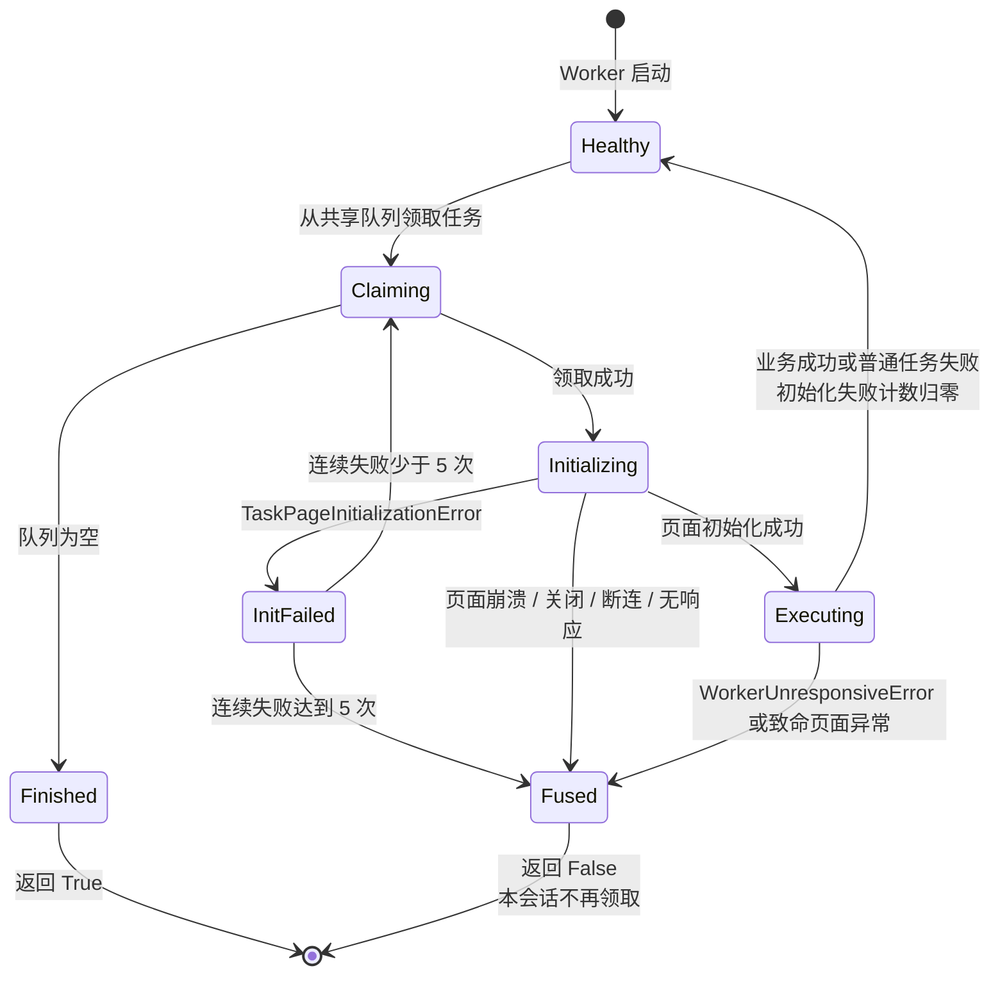
```mermaid
stateDiagram-v2
    [*] --> Healthy: Worker 启动
    Healthy --> Claiming: 从共享队列领取任务
    Claiming --> Finished: 队列为空
    Claiming --> Initializing: 领取成功
    Initializing --> Executing: 页面初始化成功
    Executing --> Healthy: 业务成功或普通任务失败<br/>初始化失败计数归零
    Initializing --> InitFailed: TaskPageInitializationError
    InitFailed --> Claiming: 连续失败少于 5 次
    InitFailed --> Fused: 连续失败达到 5 次
    Initializing --> Fused: 页面崩溃 / 关闭 / 断连 / 无响应
    Executing --> Fused: WorkerUnresponsiveError 或致命页面异常
    Finished --> [*]: 返回 True
    Fused --> [*]: 返回 False<br/>本会话不再领取
```

这里有一个关键区分：

- **业务任务失败**：任务写入 `success=false`，Worker 可以继续工作；
- **执行者失败**：Worker 熔断，停止领取后续任务；
- **普通初始化失败**：允许最多连续出现 5 次，给页面短暂恢复机会；
- **页面无响应或断连**：立即熔断，不消耗更多共享任务。

## 八、单个日期任务的完整业务流程

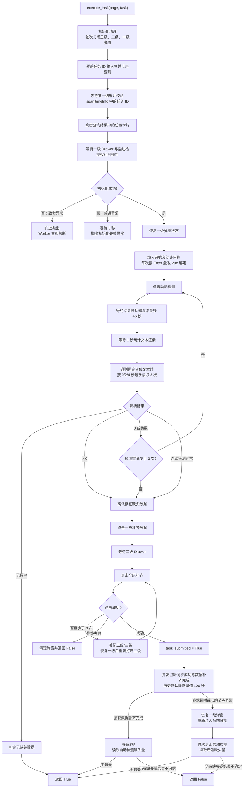
```mermaid
flowchart TD
    Start["execute_task(page, task)"] --> Init["初始化清理<br/>依次关闭三级、二级、一级弹窗"]
    Init --> SearchCard["覆盖任务 ID 输入框并点击查询"]
    SearchCard --> VerifyCard["等待唯一结果并校验 span.timeInfo 中的任务 ID"]
    VerifyCard --> OpenCard["点击查询结果中的任务卡片"]
    OpenCard --> Primary["等待一级 Drawer 与启动检测按钮可操作"]
    Primary --> InitOK{"初始化成功?"}
    InitOK -->|"否：致命异常"| Fatal["向上抛出<br/>Worker 立即熔断"]
    InitOK -->|"否：普通异常"| InitError["等待 5 秒<br/>抛出初始化失败异常"]
    InitOK -->|"是"| Restore["恢复一级弹窗状态"]
    Restore --> Dates["填入开始和结束日期<br/>每次按 Enter 触发 Vue 绑定"]
    Dates --> Detect["点击启动检测"]
    Detect --> Result["等待结果项标题渲染最多 45 秒"]
    Result --> Buffer["等待 1 秒统计文本渲染"]
    Buffer --> Read["遇到固定占位文本时<br/>按 0/2/4 秒最多读取 3 次"]
    Read --> Missing{"解析结果"}
    Missing -->|"无数字"| NoMissing["判定无缺失数据"]
    Missing -->|"> 0"| NeedFill["确认存在缺失数据"]
    Missing -->|"0 或负数"| RetryDetect{"检测重试少于 3 次?"}
    RetryDetect -->|"是"| Detect
    RetryDetect -->|"否"| NeedFill
    Missing -->|"连续检测异常"| NeedFill
    NoMissing --> Success["返回 True"]
    NeedFill --> Backfill["点击一级补齐数据"]
    Backfill --> Secondary["等待二级 Drawer"]
    Secondary --> Whole["点击全店补齐"]
    Whole --> ClickOK{"点击成功?"}
    ClickOK -->|"否且少于 3 次"| Recover["关闭二级/三级<br/>恢复一级后重新打开二级"]
    Recover --> Whole
    ClickOK -->|"最终失败"| SubmitFail["清理弹窗并返回 False"]
    ClickOK -->|"成功"| Submitted["task_submitted = True"]
    Submitted --> Heartbeat["并发监听同步成功与数据补齐完成<br/>历史默认静默阈值 120 秒"]
    Heartbeat -->|"捕获数据补齐完成"| AutoDetect["等待2秒<br/>读取自动检测缺失量"]
    AutoDetect -->|"无缺失"| Success
    AutoDetect -->|"仍有缺失或结果不可信"| Failed
    Heartbeat -->|"静默超时或心跳节点异常"| FinalRestore["恢复一级弹窗<br/>重新注入当前日期"]
    FinalRestore --> FinalDetect["再次点击启动检测<br/>读取后端缺失量"]
    FinalDetect -->|"无缺失"| Success
    FinalDetect -->|"仍有缺失或结果不确定"| Failed["返回 False"]
```

### 缺失量判断的业务兜底

| 页面文本结果 | 脚本判断 | 后续动作 |
|---|---|---|
| 找不到任何数字 | 无缺失 | 当前任务成功结束 |
| 数字大于 0 | 有缺失 | 进入补齐流程 |
| 数字等于 0 或为负数 | 前端渲染假象 | 重新启动检测，最多 3 次 |
| 固定文本 `：表示缺失数据` | 统计文本仍在渲染 | 按 0/2/4 秒等待后重读，连续 3 次仍未完成则当前任务失败 |
| 普通检测异常 | 本次后端检测不可信 | 重新点击启动检测，最多 3 次；首次检测最终不确定时进入补齐兜底，终态复检最终不确定时记为失败 |

## 九、三级弹窗层级与精准关闭

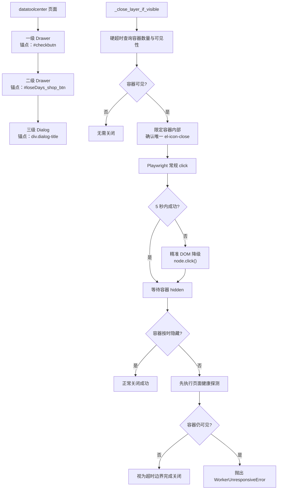
```mermaid
flowchart TD
    Page["datatoolcenter 页面"] --> P1["一级 Drawer<br/>锚点：#checkbutn"]
    P1 --> P2["二级 Drawer<br/>锚点：#loseDays_shop_btn"]
    P2 --> P3["三级 Dialog<br/>锚点：div.dialog-title"]

    Close["_close_layer_if_visible"] --> Visible["硬超时查询容器数量与可见性"]
    Visible --> Exists{"容器可见?"}
    Exists -->|"否"| Skip["无需关闭"]
    Exists -->|"是"| Unique["限定容器内部<br/>确认唯一 el-icon-close"]
    Unique --> Normal["Playwright 常规 click"]
    Normal --> Clicked{"5 秒内成功?"}
    Clicked -->|"否"| DOM["精准 DOM 降级<br/>node.click()"]
    Clicked -->|"是"| WaitHidden["等待容器 hidden"]
    DOM --> WaitHidden
    WaitHidden --> Hidden{"容器按时隐藏?"}
    Hidden -->|"是"| Closed["正常关闭成功"]
    Hidden -->|"否"| Probe["先执行页面健康探测"]
    Probe --> StillVisible{"容器仍可见?"}
    StillVisible -->|"否"| Boundary["视为超时边界完成关闭"]
    StillVisible -->|"是"| Unusable["抛出 WorkerUnresponsiveError"]
```

精准 DOM 点击并不是业务按钮的通用强制点击。它只用于：

- 已经被具体弹窗容器限定；
- 容器内部只有一个关闭叉号；
- 常规 Playwright 点击已经超时；
- 操作后能够验证容器确实隐藏。

容器在等待期限内正常进入 `hidden`，已经证明关闭动作和 DOM 状态观察均成功，因此直接视为关闭完成。只有等待 `hidden` 超时时，才额外执行 `document.readyState` 健康探测并二次查询容器：页面仍响应且容器恰好已经隐藏时，才视为“在超时边界完成关闭”。

`#checkbutn`、`#loseDays_shop_btn` 等业务按钮仍保留 Playwright 的遮挡和可操作性检查。

## 十、Worker 心跳与终态判断

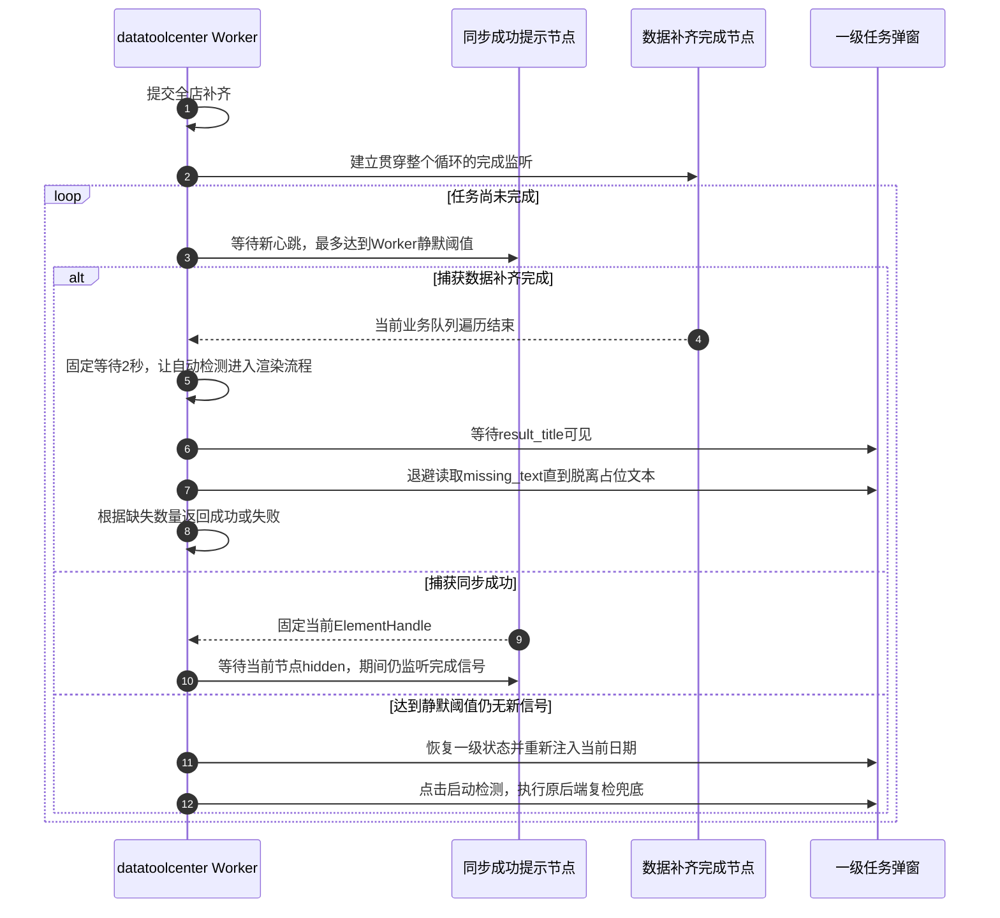
```mermaid
sequenceDiagram
    autonumber
    participant W as datatoolcenter Worker
    participant Heartbeat as 同步成功提示节点
    participant Complete as 数据补齐完成节点
    participant Primary as 一级任务弹窗

    W->>W: 提交全店补齐
    W->>Complete: 建立贯穿整个循环的完成监听
    loop 任务尚未完成
        W->>Heartbeat: 等待新心跳，最多达到Worker静默阈值
        alt 捕获数据补齐完成
            Complete-->>W: 当前业务队列遍历结束
            W->>W: 固定等待2秒，让自动检测进入渲染流程
            W->>Primary: 等待result_title可见
            W->>Primary: 退避读取missing_text直到脱离占位文本
            W->>W: 根据缺失数量返回成功或失败
        else 捕获同步成功
            Heartbeat-->>W: 固定当前ElementHandle
            W->>Heartbeat: 等待当前节点hidden，期间仍监听完成信号
        else 达到静默阈值仍无新信号
            W->>Primary: 恢复一级状态并重新注入当前日期
            W->>Primary: 点击启动检测，执行原后端复检兜底
        end
    end
```

“数据补齐完成”只表示业务队列已经遍历结束，不再直接作为任务成功依据。捕获该信号后，脚本固定缓冲 2 秒，等待 `div.testContent_list_title_dayType` 可见，再按 0、2、4 秒退避读取顶部统计，直到文本不再是 `：表示缺失数据`。自动检测确认无缺失时返回成功；仍有缺失或结果不可信时返回失败并进入对应模式的重试流程。

如果没有捕获完成信号，达到 Worker 静默阈值本身仍不等于成功。此时保留原有兜底：恢复页面层级、重新注入日期并请求后端缺失量。历史模式默认阈值为120秒：

- 统计文本不含数字，按现有页面协议表示无缺失：任务成功；
- 缺失数量大于 0：任务失败并进入对应模式的重试流程；
- 连续 3 次得到 0、负数或读取异常：结果不确定，保守记为失败。

每次检测会先等待结果列表内部的 `div.testContent_list_title_dayType` 标题渲染，再等待 1 秒读取顶部缺失统计。若读到固定占位文本 `：表示缺失数据`，不会重新请求后端，而是按 0、2、4 秒的退避节奏读取同一轮结果；连续 3 次仍为占位文本时，本次任务直接失败。

## 十一、Context 级业务执行页面 GC

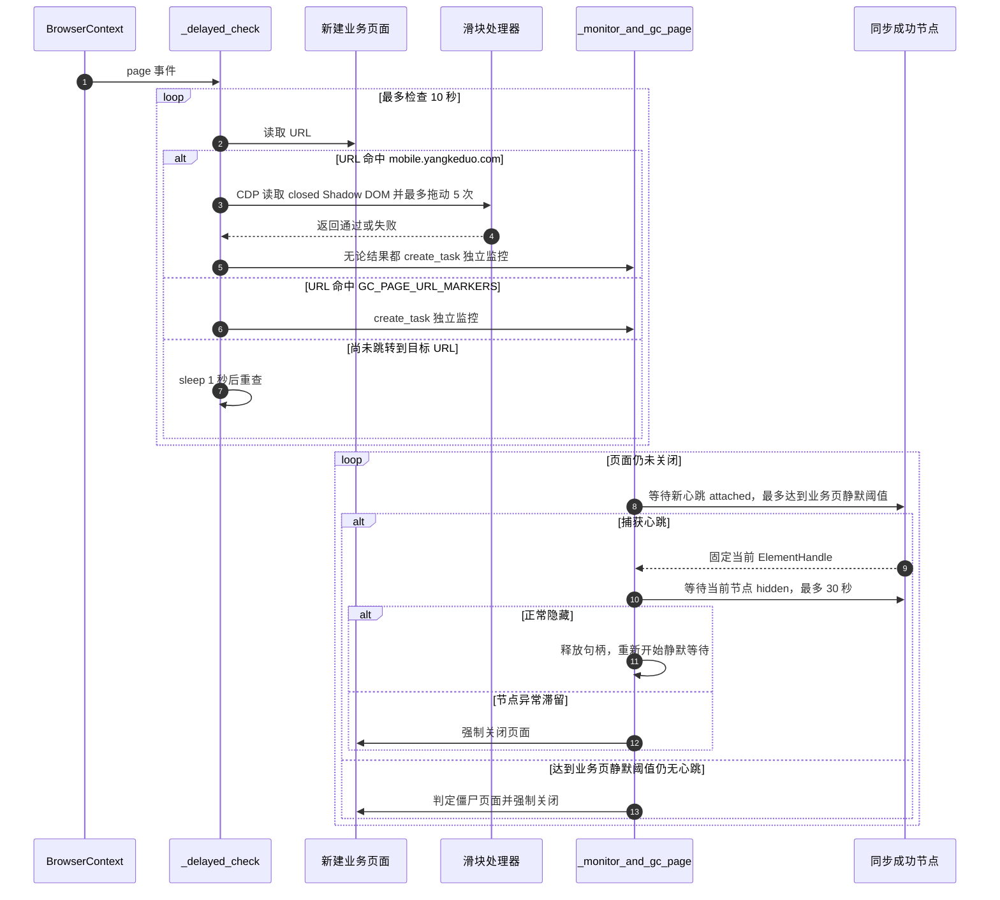
```mermaid
sequenceDiagram
    autonumber
    participant Ctx as BrowserContext
    participant Detect as _delayed_check
    participant JD as 新建业务页面
    participant Slider as 滑块处理器
    participant GC as _monitor_and_gc_page
    participant Toast as 同步成功节点

    Ctx->>Detect: page 事件
    loop 最多检查 10 秒
        Detect->>JD: 读取 URL
        alt URL 命中 mobile.yangkeduo.com
            Detect->>Slider: CDP 读取 closed Shadow DOM 并最多拖动 5 次
            Slider-->>Detect: 返回通过或失败
            Detect->>GC: 无论结果都 create_task 独立监控
        else URL 命中 GC_PAGE_URL_MARKERS
            Detect->>GC: create_task 独立监控
        else 尚未跳转到目标 URL
            Detect->>Detect: sleep 1 秒后重查
        end
    end

    loop 页面仍未关闭
        GC->>Toast: 等待新心跳 attached，最多达到业务页静默阈值
        alt 捕获心跳
            Toast-->>GC: 固定当前 ElementHandle
            GC->>Toast: 等待当前节点 hidden，最多 30 秒
            alt 正常隐藏
                GC->>GC: 释放句柄，重新开始静默等待
            else 节点异常滞留
                GC->>JD: 强制关闭页面
            end
        else 达到业务页静默阈值仍无心跳
            GC->>JD: 判定僵尸页面并强制关闭
        end
    end
```

GC 不维护业务执行页面与某个 Worker 的固定映射。原因是一个任务队列中的业务执行页可能自动关闭并重新创建；Context 级捕获可以覆盖运行期间出现的全部业务页面生命周期，启动时已经存在的页面也会被扫描。

Worker 与业务页使用两套可独立配置的静默阈值，业务页阈值必须更长。默认 120/180 秒时错开 60 秒：

- Worker 先判断数仓任务完成或卡死，并清理数仓弹窗；
- 业务执行页 GC 后处理仍未自行消失的执行页面；
- 两套机制不需要互相持有引用。

### URL 识别规则与多平台扩展

普通业务页是否纳入 GC，由 `.env` 中的统一 URL 标记决定：

```dotenv
GC_PAGE_URL_MARKERS=["ppzh.jd.com"]
```

程序启动后，该 JSON 数组会转换为 `BackfillEngine.gc_page_url_markers` 元组。`_delayed_check()` 的实时页面捕获和程序结束时的残留页扫描都调用 `_is_gc_managed_page_url()`，因此不会出现两个地方分别维护多组 `or` 条件。未来增加抖音时，可以把对应域名标记追加到 `.env` 数组中。

但只增加 URL 的前提是该平台使用相同的心跳协议，即同样通过 `.el-message__content:has-text('同步成功')` 产生并隐藏成功节点。如果抖音的提示文字、DOM 或任务生命周期不同，就应进一步把配置扩展为“URL 标记 + 心跳选择器 + 静默时间”的平台策略，而不能只增加 URL。

### 拼多多独立滑块页

`mobile.yangkeduo.com` 是当前代码内置的特殊 URL 标记，不依赖 `GC_PAGE_URL_MARKERS`。页面的滑块节点位于 closed Shadow DOM，普通 Locator 无法进入，因此 `slider_motion_tools.py` 通过页面级 CDP Session 获取 `pierce=true` 的完整 DOM 树，读取背景图、缺口图、渲染尺寸和按钮中心点。

ddddocr 的 `slide_match()` 返回缺口中心坐标；脚本将原图像素换算为页面 CSS 像素，再生成 Minimum Jerk 进度的随机贝塞尔轨迹并使用 Playwright 鼠标拖动。单页最多重新读取图片并尝试 5 次，以滑块按钮连续 3 次从 CDP DOM 树中消失作为成功条件，而不是依赖 URL 变化。

`_delayed_check()` 无论滑块最终通过、失败还是处理抛出异常，只要页面仍存在，就会给它部署 `_monitor_and_gc_page()`。该协程与延迟识别任务都由 `_track_gc_background_task()` 持有。当前 CDP 会话结束时，管理器先对它们请求取消，再通过 `asyncio.gather(..., return_exceptions=True)` 等待所有任务完成取消收尾，并统一回收取消或异常结果。最终收尾与 CDP 重建预清理的主动扫描仍只匹配 `GC_PAGE_URL_MARKERS`；滑块页如果也需要被这两次扫描兜底，应同时把相应 URL 标记加入部署环境配置。

### 程序退出前的 GC 收尾

主调度完成时，如果 Context 中已经没有业务执行页面，程序立即退出；如果仍有残留页面，则执行以下收尾：

1. 等待 `180 - 120 + 5 = 65` 秒，让已有 GC 协程完成剩余静默窗口；
2. 宽限期内页面全部自然关闭，则正常退出；
3. 宽限期后重新扫描 Context；
4. 对仍然残留的业务执行页面执行兜底关闭；
5. 完成收尾后再退出 Playwright，避免事件循环提前结束导致 GC 被取消。

### CDP 会话轮换时的业务页清理

最终 GC 收尾只属于整个 Backfill 运行的结束阶段。单次 CDP 会话因软生命周期或 Worker 全部退出而准备重建时，不继承旧 GC 计时，也不等待最终收尾宽限：

1. 先停止领取新任务，并等待所有在途 Worker attempt 完成记账、按需回队及 `task_done()`；
2. 逐个调用 `cancel()` 请求取消旧会话的业务执行页 GC 任务，再用 `asyncio.gather(..., return_exceptions=True)` 等待它们真正结束并回收取消或异常结果，避免旧 Page 代理继续操作页面；
3. 退出旧 Playwright/CDP 会话并校验缓存浏览器身份；
4. 重连成功后，在新 Worker 领取任务前扫描并关闭符合 `GC_PAGE_URL_MARKERS` 的残留业务页，但保留 `datatoolcenter` Worker 页；
5. 单个页面关闭失败只记录日志，随后继续启动 Worker，不为这项清理增加额外状态机。

初始 CDP 会话没有上一会话遗留，因此不执行预清理。关闭标签页只能整理浏览器现场，不能撤销已经提交给后端的业务请求。

## 十二、红色错误提示事件回收器

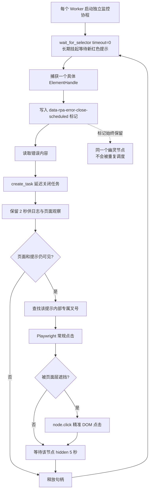
```mermaid
flowchart TD
    Start["每个 Worker 启动独立监控协程"] --> Wait["wait_for_selector timeout=0<br/>长期挂起等待新红色提示"]
    Wait --> Found["捕获一个具体 ElementHandle"]
    Found --> Mark["写入 data-rpa-error-close-scheduled 标记"]
    Mark --> Read["读取错误内容"]
    Read --> Task["create_task 延迟关闭任务"]
    Task --> Grace["保留 2 秒供日志与页面观察"]
    Grace --> Alive{"页面和提示仍可见?"}
    Alive -->|"否"| Dispose["释放句柄"]
    Alive -->|"是"| Close["查找该提示内部专属叉号"]
    Close --> Normal["Playwright 常规点击"]
    Normal --> Covered{"被页面层遮挡?"}
    Covered -->|"是"| DOM["node.click 精准 DOM 点击"]
    Covered -->|"否"| Hidden["等待该节点 hidden 5 秒"]
    DOM --> Hidden
    Hidden --> Dispose
    Dispose --> Wait

    Mark -."标记始终保留".-> Once["同一个幽灵节点<br/>不会被重复调度"]
```

该机制是事件驱动的：没有红色提示时，协程阻塞在浏览器事件等待上，不会每秒轮询 DOM。

它与业务执行页 GC 的共同思想是“捕获具体对象后管理它的生命周期”，但回收粒度不同：

- 红色提示回收器处理 Worker 页面内的 UI 节点；
- 业务执行页 GC 处理整个业务执行标签页。

## 十三、短页面操作的硬超时与健康探测

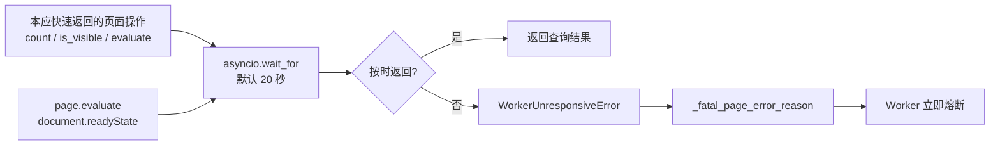
```mermaid
flowchart LR
    Op["本应快速返回的页面操作<br/>count / is_visible / evaluate"] --> WaitFor["asyncio.wait_for<br/>默认 20 秒"]
    WaitFor --> Fast{"按时返回?"}
    Fast -->|"是"| Value["返回查询结果"]
    Fast -->|"否"| Error["WorkerUnresponsiveError"]
    Error --> Fatal["_fatal_page_error_reason"]
    Fatal --> Fuse["Worker 立即熔断"]

    Ready["page.evaluate<br/>document.readyState"] --> WaitFor
```

`document.readyState` 可能返回：

- `loading`：文档仍在加载；
- `interactive`：DOM 已构建；
- `complete`：页面及资源完成加载。

这里的主要目的不是要求页面必须达到 `complete`，而是验证浏览器渲染进程能否在 20 秒内执行一次 JavaScript 并返回合法状态。只要 JS 往返及时完成，就证明页面事件循环仍有响应。

硬超时只包裹理论上应快速完成的页面探针，不包裹完整补采任务，因此不会因为任务实际运行数小时而误杀 Worker。

## 十四、JSONL 账本与队尾重试

每一次最终任务尝试写入一行：

```json
{"task_id":"card-1001_2025-07-01_2025-07-01","card":1001,"task_name":"[日] 示例任务","start":"2025-07-01","end":"2025-07-01","attempt":1,"success":false,"missing_count":7,"detail_missing_categories":["示例缺失类目"]}
```

`task_name` 在按 ID 找到唯一卡片后、点击卡片前读取。`missing_count` 只保存本次尝试最后一次可信的后端检测结果：成功为 `0`，确认仍有缺失为正整数，未完成终态检测或结果不可信为 `null`。`detail_missing_categories` 在终态检测完成后读取当前一级弹窗中的全部 `loseItem`：`null` 表示未完成可信检测，空列表表示确认没有缺失类目，非空列表保存具体类目。Backfill 和 Daily 共用该账本结构。

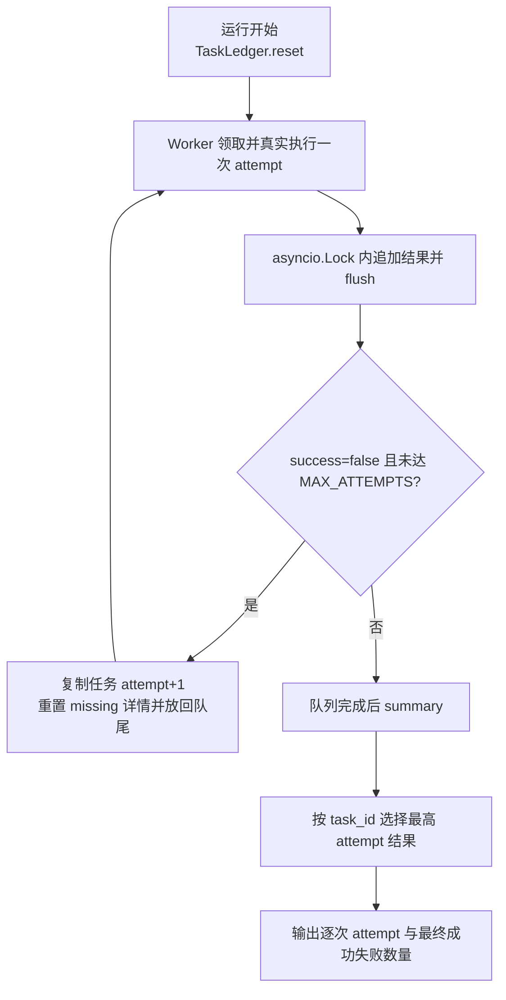
```mermaid
flowchart TD
    Reset["运行开始<br/>TaskLedger.reset"] --> Attempt["Worker 领取并真实执行一次 attempt"]
    Attempt --> Record["asyncio.Lock 内追加结果并 flush"]
    Record --> Failed{"success=false 且未达 MAX_ATTEMPTS?"}
    Failed -->|"是"| Requeue["复制任务 attempt+1<br/>重置 missing 详情并放回队尾"]
    Requeue --> Attempt
    Failed -->|"否"| Summary["队列完成后 summary"]
    Summary --> Latest["按 task_id 选择最高 attempt 结果"]
    Latest --> Report["输出逐次 attempt 与最终成功失败数量"]
```

当前 Backfill 策略是：

- 整次运行只创建一个顶层共享队列，跨多个 CDP 生命周期复用；
- 每次真实执行后才写一条 JSONL，未领取任务绝不批量伪造失败记录；
- 失败任务立即进入队尾，默认最多执行 5 次；
- 账本只记录结果，不拥有或重建队列；
- 最终失败数仍为配置任务总数减最终成功数，因此未完成任务会进入汇总失败数。

## 十五、异常分类与处理矩阵

| 异常类型 | 典型场景 | 当前任务 | 当前 Worker / 会话 | 后续处理 |
|---|---|---|---|---|
| 普通业务失败 | 二级弹窗打不开、全店补齐未提交、任务判定卡死 | 写入失败 | Worker 继续领取 | 未达上限立即回队尾 |
| 单次初始化失败 | 旧弹窗或页面状态暂时异常 | 写入失败 | 累计一次 | 未达上限立即回队尾 |
| 连续初始化失败 | 页面长期无法恢复到可操作状态 | 当前 attempt 写入失败 | 当前 Worker 熔断 | 其他 Worker 或新会话继续 |
| 页面查询硬超时 | `count()`、`is_visible()`、JS 健康探测无响应 | 写入失败或结果未知 | 当前 Worker 熔断 | 其他 Worker 或新会话继续 |
| 单 Page 关闭或崩溃 | 用户关闭一个 Worker 页、渲染目标 crash | 当前 attempt 写入失败 | 只淘汰当前 Worker | 其他 Worker 继续 |
| Driver/CDP 全局断连 | Playwright transport 关闭、Browser disconnected | 在途 attempt 正常或异常收尾 | 停止整个会话 | 身份一致才允许重建 |
| 业务页达到 GC 静默阈值 | 业务执行页成为僵尸页面 | 不直接决定账本结果 | 不绑定 Worker | GC 关闭业务页 |
| 红色提示遮挡 | 登录失效或接口异常导致提示堆积 | 主业务继续运行 | 监控器延迟回收 | 不直接影响队列 |

## 十六、脚本模块职责说明

### 1. 配置与入口模块

`load_runtime_config()` 从源码或 exe 同目录的 `.env` 读取浏览器类型、连接参数、任务列表、GC URL 标记和历史模式心跳阈值。列表使用 JSON 表达并经过类型校验；入口随后创建对应连接器和 `BackfillEngine`，再通过 `asyncio.run()` 启动异步总控流程。真实 `.env` 只保留在本地，仓库提交可直接复制的 `backfill.env.example` 脱敏模板。

### 2. 浏览器连接模块

`BitBrowserConnector` 使用 `BITE_ID` 调用比特浏览器本地 API；`ExternalCdpConnector` 使用 `CDP_ADDRESS` 请求 `/json/version`，确认端口确实提供 Chromium CDP。二者统一返回 `host:port`，`run()` 无需知道浏览器来源，只负责使用 Playwright 接管浏览器，并把 URL 包含 `datatoolcenter` 的标签页识别为 Worker。

### 3. 任务构建模块

`generate_date_chunks()` 按 `chunk_days` 切分历史区间；`build_tasks()` 为每个日期区块生成唯一 `task_id`，去除重复配置，然后形成初始任务列表。

### 4. 生命周期调度模块

`run()` 在整个 Backfill 期间持有唯一 `asyncio.Queue`。`_run_cdp_session()` 和 `_run_task_pool_session()` 只管理当前 Playwright/CDP 生命周期的 Context、Worker 与后台协程；软期限、断连或 Worker 全退后，未领取任务继续保留在顶层队列。

### 5. Worker 执行与熔断模块

`worker()` 负责循环领取任务、调用 `execute_task()`、把结果写入账本，并维护连续初始化失败次数。普通业务失败不会淘汰 Worker；连续 5 次初始化失败、页面无响应、崩溃或断连会触发熔断。

### 6. 单任务业务模块

`execute_task()` 完成一个日期区块的全部业务操作：清理遗留弹窗、进入指定任务卡片、注入日期、启动检测、读取缺失量、打开二级弹窗、点击全店补齐，并进入心跳终态判断。

### 7. 弹窗定位与恢复模块

`_primary_drawer()`、`_secondary_drawer()` 和 `_progress_dialog()` 使用内部业务锚点区分三级容器。`_close_layer_if_visible()` 只对弹窗内部唯一叉号提供精准 DOM 降级；`_restore_primary_state()` 负责回到一级弹窗可操作状态。

### 8. Worker 心跳模块

`wait_for_completion_or_heartbeat()` 在数仓 Worker 页并发监听“同步成功”和“数据补齐完成”。完成信号只触发自动检测结果读取，确认无缺失后才成功；仍有缺失或结果不可信时失败。没有完成信号时，达到静默阈值仍使用主动后端复检兜底。历史模式默认 120 秒，也可通过 `.env` 调整。

### 9. 业务执行页面 GC 模块

`_on_new_page()` 与 `_delayed_check()` 从 BrowserContext 层识别符合 URL 标记的业务执行页面，`_monitor_and_gc_page()` 独立监听每个页面的成功心跳。达到业务页静默阈值或单个心跳节点异常滞留时，GC 关闭该页面。`mobile.yangkeduo.com` 会先交给 `slider_motion_tools.py` 处理 closed Shadow DOM 滑块，无论结果如何都继续部署 GC。CDP 重建成功后，`_close_remaining_gc_pages()` 在新 Worker 领取任务前清理配置标记命中的残留页；整个 Backfill 完成时，`_cleanup_remaining_gc_pages()` 才按两个静默阈值之差再加 5 秒提供最终收尾宽限。Backfill 与 Daily 默认 Worker/业务页为 120/180 秒，均可通过 `.env` 调整。

### 10. 红色错误提示回收模块

`_monitor_worker_error_toasts()` 事件等待每个 Worker 页面的红色提示，为具体节点添加防重复标记，并创建延迟关闭任务。提示保留 2 秒后关闭；常规点击被遮挡时，仅对专属叉号使用 `node.click()`。

### 11. 页面健康与硬超时模块

`_await_page_operation()` 为本应快速完成的 DOM 查询增加 20 秒外层硬超时。`_assert_page_healthy()` 通过 `document.readyState` 执行一次 JavaScript 往返，用于确认超时页面的渲染事件循环是否还能响应。

### 12. 任务账本与重试模块

`TaskLedger` 使用 `asyncio.Lock` 串行追加 JSONL 结果。Worker 在一次真实 attempt 完成后写账本，失败且未达到上限时直接复制任务并放回顶层队尾。`summary()` 按每个任务的最高 attempt 汇总；队列所有权始终属于 Backfill 顶层调度器。

## 十七、脚本完整运行逻辑摘要

1. 从 `.env` 读取并校验浏览器来源、连接参数、任务、GC URL 和心跳阈值；
2. 使用 `BITE_ID` 启动比特浏览器，或使用 `CDP_ADDRESS` 检查外部 Chromium；
3. 连接 BrowserContext，识别数仓 Worker 页面；
4. 在 Context 层挂载新页面观察器，扫描已有页面，并按 URL 分发滑块处理或业务页 GC；
5. 把配置日期切分成唯一日期区块，并一次性装入顶层持久队列；
6. 重置 JSONL 任务账本，为每个 Worker 启动红色提示监控器；
7. 为当前 CDP 生命周期的多个 Worker 启动持续任务池；
8. 每个 Worker 清理遗留弹窗，按任务卡片 ID 查询、校验并打开唯一结果，再注入当前区间日期；
9. 检测缺失数据；无缺失则直接成功，有缺失则进入全店补齐；
10. 提交后并发监听心跳和数据补齐完成；完成信号出现后读取自动检测缺失量并据此判定结果，未捕获时在静默后执行主动后端复检兜底；
11. 拼多多独立滑块页最多自动拖动 5 次；普通业务页和处理后的滑块页均由更长的独立静默阈值回收；
12. 每次真实 attempt 结束后立即把结果追加到 JSONL，失败且未达上限则复制后放回队尾；
13. 单 Page 关闭或崩溃只淘汰当前 Worker，全局 Driver/CDP 断连才停止整个会话；
14. 到达软生命周期后禁止新领取，等待所有在途任务正常或异常收尾；
15. 请求取消当前会话全部 Worker 和 GC 后台任务，并等待它们完成取消收尾；
16. 队列未完成时，只读校验缓存 `/json/version` 的浏览器身份；
17. 身份一致且有额度时新建 Playwright/CDP 会话，在 Worker 启动前清理一次残留业务页，再继续消费同一队列；
18. 整个队列完成后执行一次带宽限期的最终 GC 收尾；
19. 根据每个 `task_id` 的最新尝试结果输出最终成功和失败汇总。

## 十八、Daily Mode：登录态重建、动态 Worker 与旁路通知

`daily_engine.py` 复用历史补采的 Worker、弹窗、GC、账本和失败重试能力，但外围生命周期不同：它先关闭并重启指定 Bit 浏览器，再为本次单日任务创建 Worker 页面。

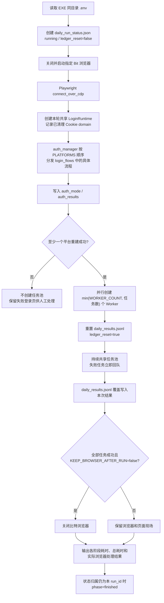
```mermaid
flowchart TD
    Start["读取 EXE 同目录 .env"] --> Status["创建 daily_run_status.json<br/>running / ledger_reset=false"]
    Status --> Bit["关闭并启动指定 Bit 浏览器"]
    Bit --> CDP["Playwright connect_over_cdp"]
    CDP --> Runtime["创建本轮共享 LoginRuntime\n记录已清理 Cookie domain"]
    Runtime --> Auth["auth_manager 按 PLATFORMS 顺序\n分发 login_flows 中的具体流程"]
    Auth --> AuthStatus["写入 auth_mode / auth_results"]
    AuthStatus --> Result{"至少一个平台重建成功?"}
    Result -->|"否"| Keep["不创建任务池\n保留失败登录页供人工处理"]
    Result -->|"是"| Worker["并行创建 min(WORKER_COUNT, 任务数) 个 Worker"]
    Worker --> Reset["重置 daily_results.jsonl<br/>ledger_reset=true"]
    Reset --> Pool["持续共享任务池\n失败任务立即回队"]
    Pool --> Ledger["daily_results.jsonl 覆盖写入本次结果"]
    Ledger --> Finish{"全部任务成功且\nKEEP_BROWSER_AFTER_RUN=false?"}
    Finish -->|"是"| Close["关闭比特浏览器"]
    Finish -->|"否"| KeepFinal["保留浏览器和页面现场"]
    Close --> Summary["输出各阶段耗时、总耗时和实际浏览器处理结果"]
    KeepFinal --> Summary
    Summary --> Finished["状态归属仍为本 run_id 时<br/>phase=finished"]
```

Daily 的计时使用 `time.perf_counter()`，分别覆盖浏览器关闭并重启、登录预检、Worker 初始化和持续任务池；外层 `finally` 统一补充总运行时间。因此参数错误、浏览器启动失败或登录预检失败等提前退出路径，也会留下总耗时和实际浏览器处理结果，而不会再固定打印“保留现场”。

### 登录态重建预检

日常模式不能假定 Bit 浏览器中的登录态可靠可用。`auth_manager.py` 只负责共享环境准备、按配置顺序分发流程并生成 `AuthReport`；具体 URL、等待、定位器、点击和验证动作保存在 `login_flows.py`。

当前登录预检规则为：

1. `auth_manager.py` 为整轮预检创建一个共享 `LoginRuntime`，再按配置顺序将每个平台交给 `auth_mode` 对应的注册流程；
2. `pkl_cookie` 流程在清理旧状态前完整加载并格式化 pkl，无法得到有效 Cookie 或 domain 时直接失败；
3. 流程只清理 pkl 中涉及的精确 Cookie domain，不再清空整个 `BrowserContext`；
4. `LoginRuntime` 保存本轮已经清理的精确 domain 字符串；后续平台遇到完全相同的 domain 时不重复清理，父域与子域不会被视为同一个值；
5. 注入完成后再次访问 `home_url`，仍进入 `login_url_markers` 指定的登录页则判定失败；
6. `1688_button_login` 流程沿用现有按钮登录和成功元素校验；
7. 成功预检页关闭，失败预检页保留给人工巡检或登录。

当前注册表包含 `pkl_cookie`、`1688_button_login`、`tmall_supermarket_active_login`、`qianniu_workbench_active_login`、`dou_shop_active_login`、`kuaishou_xiaodian_active_login`、`pdd_active_login`、`reduyun_active_login` 和 `jingzuanke_active_login`。平台未填写 `auth_mode` 时默认走 `pkl_cookie`；未知模式会在该平台预检阶段明确失败，不会静默回退。

按 domain 清理会移除该 domain 下所有名称和路径的旧 Cookie。该策略适用于当前“一台浏览器通常只重建一个平台登录态”的业务模式，同时保留其他未涉及 domain 的既有登录态。

Daily 只在至少一个平台预检成功后挂载 Context 新页面观察器，并且不扫描挂载前已有页面。这样登录失败后特意保留的诊断页不会被当成任务执行页回收；后续创建 Worker 及任务运行期间产生的新业务页才进入滑块处理与 GC。

### 单机飞书巡检器

`daily_notify_agent.py` 不接入浏览器，也不读取内存中的任务池。它以文件为边界，递归扫描本机 `dailyfill` 下每个客户目录的 `.env`：

1. `REPORT_READY_TIME` 未到的客户不纳入本次通知；
2. 用 `DAILY_TASKS` 中每项的 `card_id` 和 `target_date_offset_days` 还原当天应有的 `task_id`；字段缺失或无效时将该客户标记为配置异常；
3. 读取 `daily_run_status.json`，只在状态属于今天且 `ledger_reset=true` 时读取新版账本；没有状态文件的旧部署继续兼容；
4. 从 `auth_results` 汇总登录失效的平台，全部失败时标记“登录异常”；
5. 读取 `daily_results.jsonl` 的每个任务最新尝试，计算完成数量，并展示任务名称、可信的剩余缺失条数与全部具体缺失类目；
6. 任务未完成时检查 `daily_run.log` 的最后修改时间，超过阈值则标记“疑似故障”；
7. 将全部客户状态合并为一条可展开详情的飞书交互卡片。

这使采集 EXE 与通知 EXE 可以独立运行：采集异常不会阻止通知器继续巡检；状态文件会决定旧账本是否可读，避免把上一次结果误算到本轮。通知器异常也不会影响采集任务。

### Daily 专属即时重试

Daily 继续使用自己的 `_daily_worker()` 与 `_run_daily_task_pool()`，不会被 Backfill 的多 CDP 生命周期调度替换。两者都采用失败立即回队，但 Daily 的浏览器启停、登录预检和任务池收尾语义保持独立：

1. Worker 使用 `await queue.get()` 持续等待任务，不因队列暂时为空立即退出；
2. 每次尝试都先把结果追加到 `daily_results.jsonl`；
3. 失败且未达到 `MAX_ATTEMPTS` 时，将任务的 `attempt` 加一并立即放回队尾；
4. 成功或达到最大次数后不再回队；
5. `queue.join()` 只会在所有任务到达终态后返回，调度器随后用哨兵统一停止健康 Worker；
6. 页面无响应、崩溃或断连仍会使当前 Worker 熔断，但其失败任务可以由其他健康 Worker 继续领取。

Backfill 的队列跨 CDP 生命周期存在；Daily 当前仍在一次由自身管理的浏览器会话内完成任务池。

### 统一的业务 UI 超时

Backfill 与 Daily 共用的任务卡片弹窗、检测按钮、缺失数量节点、补齐按钮等普通业务元素，其等待和点击统一放宽到 30 秒，用于承受多脚本并存时的短暂资源竞争。代码不再维护模式专属的 timeout 覆盖字段。

以下时间没有被统一放宽，因为它们承担不同语义：

- 一级弹窗恢复后的 5 秒 `trial=True` 可操作性检查；
- `page.goto()` 与 datatoolcenter 自动登录后的稳定等待；
- 20 秒页面健康探针；
- Worker 心跳静默判断（Backfill 与 Daily 均可配置，默认 120 秒）；
- 业务执行页 GC 静默判断（Backfill 与 Daily 均可配置，默认 180 秒）；
- 单个 Worker/GC 心跳节点 30 秒隐藏等待；
- 红色提示和弹窗关闭器的旁路回收超时。
